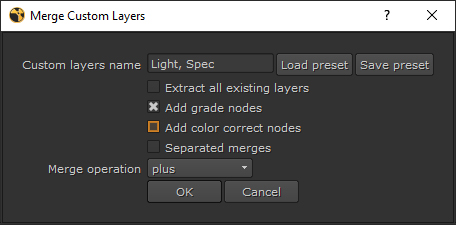

# CustomLayersMerge

## What's this script purpose ?!
This script allows you to automatically shuffle a bunch of layers based on their name, add a grade and/or a color node, and merge them back together.

## How to install

1 - Add the script path to the nuke plugin path

- Check if the file C:\Users\UserName\.nuke\init.py exists
    - If it doesn't exists:
        - Create a file named init.py in the C:\Users\UserName\.nuke\ directory
        - Open the file with a text editor
        - Write the following command
        
        ```
      import nuke
        nuke.pluginAddPath('your/script/path')
      ```
      
  - If it already exists:
    - Check that the `import nuke` exists on the first line
    - Add the following command ` nuke.pluginAddPath('your/script/path')`
    
- Be careful to add ' around your path, and point to the script directory (containing the menu.py file)
- i.e: `nuke.pluginAddPath('H:/Perso_python/scripts/CustomLayersMerge')`

2 - Launch Nuke

## How to launch the script

- In the 'Custom' menu in the Nuke toolbar, click on Custom Layers Merge

## How to use

1 - Select one or more read nodes from which you want to extract some layers

2 - Launch the script

3 - Enter one or more custom layer name (the part of your layers name that is common to all the wanted layers)

4 - Choose the options and merge operation

5 - Click ok 

That's it !

## I.e

1 - A nuke script containing a bunch of read nodes is opened  


2 - The user select the wanted read nodes


3 - In the custom menu the user launches the tool


4 - The tool's UI opens


5 - The user change the custom layers name based on the names he wants to extract


6 - All the layers containing a work in the custom layers name are extracted with shuffles, range nodes are created and everything is merged together using the provided operation.


## Options

- Extract all existing layers
    - The tool doesn't take the custom layers name in account and will extract all the available layers in the read node.
    
- Add grade nodes
    - Add a grade node after each shuffle
    
- Add color correct nodes
    - Add a color correct node after each shuffle
    
- Separated merges
    - Instead of using one merge for all the shuffles, the tool creates one merge for each.

## Tips & tricks
- You can select multiple Read nodes at onces
- You can save the actual configuration as a preset by using the "Save preset" button
- You can load the last configuration preset by using the "Load preset" button
- You can use the add grade nodes and add color correct nodes together

## What the script doesn't do
- The script automatically place the created nodes based on the read position BUT if there's already existing nodes in the way, this could lead to strange positioning. Space correctly your read nodes before using this tool.

## Licence
This program is free software: you can redistribute it and/or modify
it under the terms of the GNU General Public License as published by
the Free Software Foundation, either version 3 of the License, or
(at your option) any later version.

This program is distributed in the hope that it will be useful,
but WITHOUT ANY WARRANTY; without even the implied warranty of
MERCHANTABILITY or FITNESS FOR A PARTICULAR PURPOSE.  See the
GNU General Public License for more details.

You should have received a copy of the GNU General Public License
along with this program.  If not, see <https://www.gnu.org/licenses/>.

## Credits
Created by Tristan Le Granche    

Send bugs report to tristan.legranche@gmail.com

[Download last version](https://github.com/Strangenoise/CustomLayersMerge) 